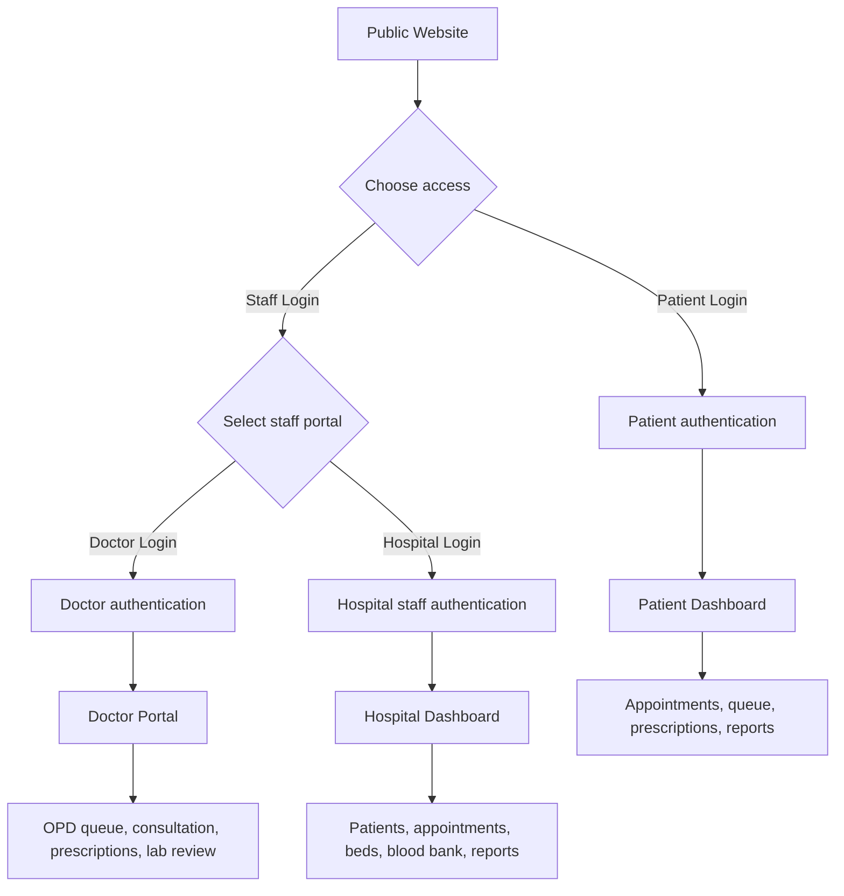
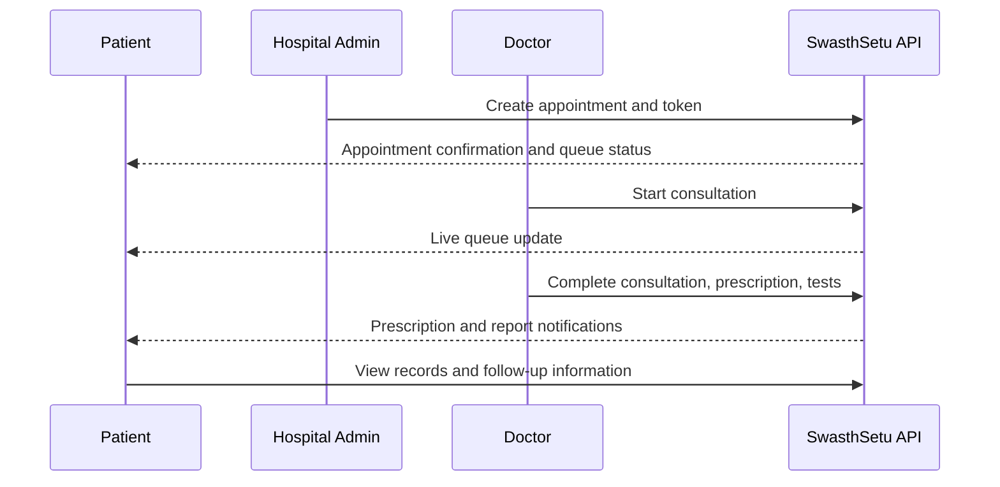
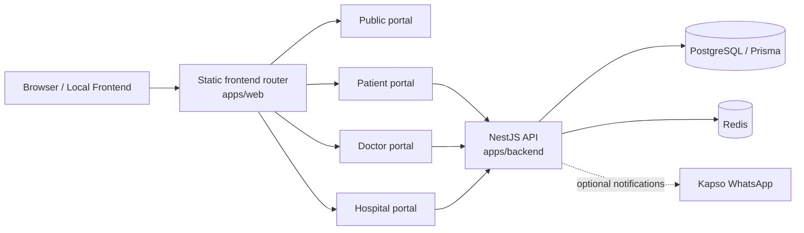

# SwasthSetu

> A unified digital healthcare platform for Indian Government Hospitals — connecting citizens, doctors, and hospital staff through one secure care journey.

SwasthSetu is a hackathon-ready Government Hospital Management Platform. It brings appointment booking, OPD queues, clinical consultations, prescriptions, laboratory reports, bed and blood availability, and hospital operations into a single modular application.

## Why SwasthSetu

Government hospital care often involves long queues, fragmented records, and limited visibility into real-time availability. SwasthSetu provides a simple digital layer around that journey:

- Patients can access appointments, live queue updates, prescriptions, reports, medical history, blood, and bed availability.
- Doctors get a focused OPD clinical workspace to review patients and complete consultations efficiently.
- Hospital teams use one role-based operations portal to manage patients, appointments, beds, blood inventory, lab reports, and analytics.

## Product flow



### Care journey



## Architecture



## Portals and roles

| Portal | Intended user | Main capabilities |
| --- | --- | --- |
| Public Website | Citizens | Hospital search, availability, appointment entry point, login |
| Patient Dashboard | Registered patient | Appointments, live queue, digital prescriptions, reports, history, notifications |
| Doctor Portal | Hospital doctors | Today's OPD, live queue, patient records, consultation workspace, prescriptions, lab review |
| Hospital Dashboard | Hospital staff | Operational overview, patient/doctor/appointment management, beds, blood bank, labs, analytics |

Hospital staff use the same Hospital Dashboard with role-based permissions. For example, a receptionist can work with patients and appointments, while lab and blood bank staff see only their relevant modules.

## Project structure

```text
swasthsetu/
├── apps/
│   ├── web/              # Static modular frontend
│   │   ├── public/       # Landing and login route pages
│   │   └── src/          # Public, patient, doctor, hospital, shared modules
│   └── backend/          # NestJS API, Prisma, Docker configuration
├── docs/                 # Architecture, auth, features, migration notes
├── scripts/              # Local frontend server
├── README.md
└── package.json
```

For the complete move-by-move structure, see [docs/FOLDER_STRUCTURE.md](docs/FOLDER_STRUCTURE.md).

## Run locally

### Prerequisites

- Node.js 20+
- pnpm
- Docker Desktop (for PostgreSQL and Redis)

### 1. Start database services and API

```powershell
cd apps/backend
docker compose up -d
pnpm prisma:migrate
pnpm prisma:seed
pnpm build
pnpm start
```

The API runs at `http://127.0.0.1:3000/api/v1`.

### 2. Start the frontend

From the repository root:

```powershell
npm run frontend
```

Open [http://127.0.0.1:4173](http://127.0.0.1:4173).

## Demo accounts

| Role | Login | Password / method |
| --- | --- | --- |
| Hospital Admin | `HA-1001` | `ChangeMe123!` |
| Doctor | `DR-1001` | `ChangeMe123!` |
| Patient | `9000000001` | Request development OTP in the patient login dialog |

### Suggested demo sequence

1. Log in as Hospital Admin and create an appointment with a patient and doctor.
2. Open the Doctor Portal and start then complete the consultation from the live queue.
3. Open the Patient Dashboard to view the appointment update, notification, and digital care records.

## Key technology

- **Frontend:** HTML, CSS, vanilla JavaScript
- **Backend:** NestJS, TypeScript, REST API
- **Database:** PostgreSQL with Prisma ORM
- **Caching:** Redis
- **Authentication:** JWT, role-based access control, OTP-ready patient flow
- **Notifications:** Kapso WhatsApp integration is prepared as an optional next step

## Documentation

- [Architecture](docs/ARCHITECTURE.md)
- [Authentication flow](docs/AUTHENTICATION.md)
- [Features](docs/FEATURES.md)
- [Folder structure and migration summary](docs/FOLDER_STRUCTURE.md)
- [Demo guide](DEMO.md)

## Project status

SwasthSetu is designed as a functional hackathon demo with a modular codebase and real local API/data services. WhatsApp delivery can be enabled later by completing the Kapso number setup and configuring its production credentials.
